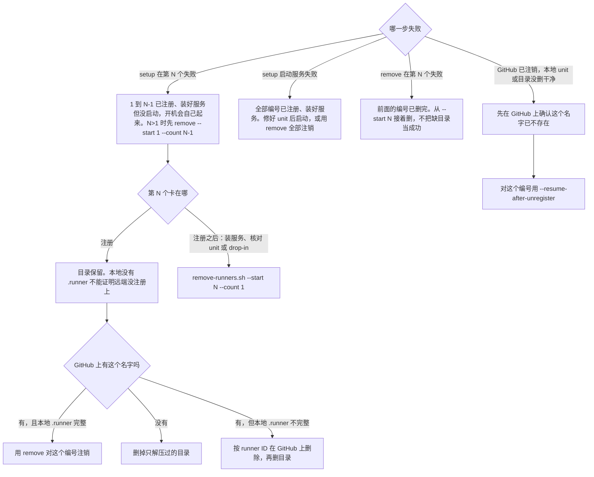

# 部署、删除和失败恢复

用 `scripts/setup-runners.sh` 部署、用 `scripts/remove-runners.sh` 删除，或者其中一个中途失败要收拾时读这份。

远端执行时复制整个 `scripts/` 目录，保留两个 shell 脚本与 `read-runner-identity.py` 的同级关系。两个脚本都调用这个 Python 入口读取 `.runner`，不能只上传单个 shell 文件。仍用 `bash <dir>/scripts/setup-runners.sh` 或 `bash <dir>/scripts/remove-runners.sh` 执行，无须给 helper 执行权限。

## 开始前要定下来的值

组织、runner 名前缀、数量、Linux 服务用户（默认 `actions`）、label 和 runner group。两个脚本都要 root、systemd 和维护窗口。setup 要求同一 Linux 用户下所有 runner 都已 drain、停掉、没有残留进程。remove 要求目标 runner 已 drain、同用户下目标之外的 runner 已停；目标 unit 由脚本自己停，注销失败时也由它重启。条件不满足，脚本直接拒绝。

不要提前手动停目标 unit：脚本会以为它原本没在跑，注销失败后不会把它拉起来。

## 拿 token

注册和注销各用一个短期 token，有效期一小时，由 REST API 发：`POST /orgs/<ORG>/actions/runners/registration-token` 和 `.../remove-token`。调用者要是组织 admin，classic token 要带 `admin:org` scope。

token 只走文件，不进命令行：

```bash
token_file=$(mktemp)
trap 'rm -f "$token_file"' EXIT
gh api -X POST /orgs/<ORG>/actions/runners/registration-token --jq .token >"$token_file"
sudo bash <dir>/scripts/setup-runners.sh --token-file "$token_file" \
  --org <ORG> --count 8 --labels <LABELS> --prefix <PREFIX> --drained --yes
rm -f "$token_file"
```

删除时把 `registration-token` 换成 `remove-token`，脚本换成 `remove-runners.sh --token-file "$token_file" --org <ORG> --prefix <PREFIX> --count 8 --drained --yes`。

两个脚本只接受 `--token-file`，不从命令行参数或环境变量接收 token；确认远端已注销后的 `--resume-after-unregister` 不传 token。

## token 怎么交给 runner

脚本用空环境调用 `runuser` 切到服务用户，只给 `HOME`、身份、shell 和一个固定的 `PATH`。这样外层的 `SUDO_COMMAND` 和 root 的其他环境变量都不会进 runner 用户的进程树。

但 GitHub 的 `config.sh` 运行期间 token 仍在它的 argv 里。argv 本身对本机所有用户可见（除非 `/proc` 挂了 `hidepid`），同 UID 的进程还能读它的环境和内存。所以脚本在交出 token 前要求这个 UID 下没有别的进程，这台机器上也不应有不受信任的本地用户。这道 drain 检查是 token 保护的一部分，不能删。

## 部署

- 按 `uname -m` 选官方包，支持 Linux x64、ARM64 和 ARM32。包下载到 root 所有的 `/var/cache/github-actions-runner`，核对 GitHub release 上的 SHA-256 digest 和包内文件。
- 只做全新部署。任何一个目标目录已存在就停，从不给 `config.sh` 传 `--replace`。注册 token 证明不了另一台机器上的同名 runner 已经空闲，远端同名冲突要先在 GitHub 上处理。
- `--labels` 接受逗号分隔的多个 custom label。多个 label 时必须单独给 `--prefix`，免得把路由用的别名当成 runner 的名字。
- runner 注册时会把当时的 `PATH` 写进实例目录的 `.path`，之后服务和 job 都以它为基础 `PATH`。默认值是服务用户的 `~/.local/bin`、`~/.local/share/mise/shims`、`~/bin` 加完整系统路径；还要别的工具目录时显式传 `--runner-path`。
- 默认装最新版并保留 runner 自更新；`--runner-version` 固定版本，同时关掉自更新。
- 启动前逐个核对 `.runner` 身份、unit 的 `User`、`FragmentPath`、`ExecStart` 和 enable 状态。unit 继承了别处的 drop-in（`DropInPaths` 非空）就停；逐个看过、确认都是有意的，才在下一次全新部署时加 `--accept-inherited-dropins`。
- 脚本最后报告的是本地部署结果。GitHub 上的 online、busy、label 和 group 要另外核对。

## 删除

- 删之前核对 `.runner` 里的组织和名字；装了服务的，还核对 unit、服务用户、`FragmentPath` 和 `ExecStart`。不带 `--drained` 不停服务也不注销。
- `.service` 文件存在时 `config.sh remove` 会拒绝注销（报 `Uninstall service first`）。脚本先停 unit，把 `.service` 暂存到 root 才能读的恢复目录，再注销。注销用实例现有的 `.path`，这样注销失败回滚后服务和 job 的 `PATH` 不变。
- 注销失败：放回 `.service`，重启停之前在跑的服务。注销成功才删 unit；注销和本地清理都成功才删实例目录。
- 调用 GitHub 之前，脚本把组织、名字、目录和 unit 写进 `/var/lib/github-actions-runner-removal/`（root 所有，目录 `0700`，记录文件 `0600`）。`.runner` 已经没了时，`--resume-after-unregister` 靠这份记录防止参数写错删到别的编号。
- 正常删除在交出 token 前同样要求服务用户下没有任何进程。容器里的进程可能在宿主上映射成同一个 UID，`pgrep -u` 分不出它是不是 runner。有 token 时一律拒绝，再用 `/proc/<PID>/cgroup` 找出是谁。
- `--resume-after-unregister` 不收 token，只做本地清理，所以不管无关的同 UID 进程；但仍会递归检查目标 unit 的 cgroup 和子 cgroup，并按可执行文件、工作目录和 argv 找残留的目标 runner 或 job 进程。
- 每个 unit 自己的 drop-in 随 unit 一起删。前缀共用的 drop-in 只报告不删，确认没有别的 unit 继承后再手动删。

## 失败后从哪接着做

批量操作不是 GitHub 和主机之间的原子事务。按失败的位置接着做：



按 ID 删除用 `DELETE /orgs/<ORG>/actions/runners/<RUNNER_ID>`，ID 从 `GET /orgs/<ORG>/actions/runners` 按名字查；删之前确认它 `busy=false`。

`--resume-after-unregister` 允许 unit 已经没了、或 `.runner` 还残留，只清理和该组织、名字对得上的本地状态，不调用 GitHub。

## 在 `/run` 放临时 root 脚本

`/run` 可能挂成 `noexec`。脚本保持 root 所有、`0600`，在 transient unit 或命令里写 `/bin/bash /run/<HELPER>`。直接把 `/run/<HELPER>` 设成 `ExecStart` 会得到 `203/EXEC`。换成解释器调用不改变 token、drain 和身份核对这些检查。
