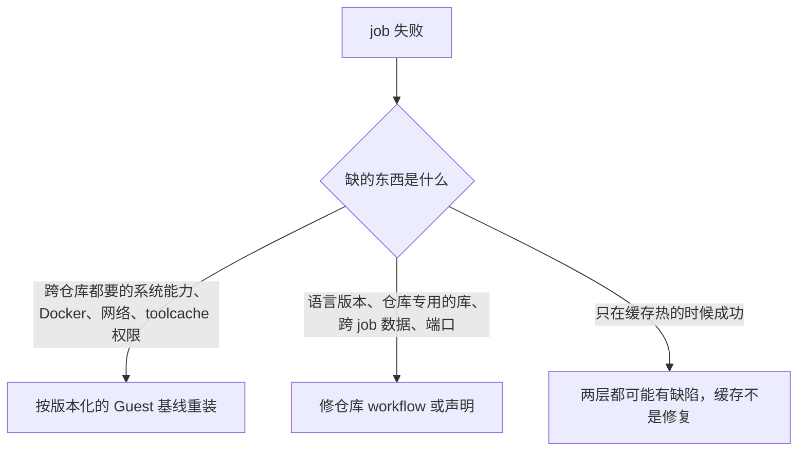

# 持久 VM 的基线和 builder 约定

一个持久 VM 里有多个组织 runner，共用一个 Guest Docker daemon 和一些固定的工具基线时读这份：job 失败要判断该修哪一层，或者要改 toolcache、Go 缓存或 BuildKit builder。VM 把 CI 和宿主隔开，但 VM 里的 job 之间没有隔离。

宿主的通用生命周期、网络、存储和资源边界由 `$linux-server` 负责并验证。下表里宿主那一行只写 CI 额外要它承担的部分。

## 先分层，再动手

动手前把每个事实归到一层：

| 层 | 负责 | 不负责 |
| --- | --- | --- |
| 宿主 | 通用虚拟化约定，加上 CI 要拦的受保护目标和池的外部监控 | Guest 软件包、仓库依赖、job 产物 |
| Guest 基线 | 稳定的系统能力、Docker 和插件、runner 服务、toolcache 布局和权限、持久 builder 服务 | 仓库的语言版本矩阵、应用库、跨 job 传数据 |
| 每个 runner 自己的状态 | runner 身份、独立的临时目录和 mise 状态、可写的 toolcache 父目录、独立的固定版本工具副本 | 影响正确性的共享可变状态 |
| 仓库 workflow | 语言和依赖声明、reusable workflow 固定版本、artifact 传递、并发时的端口分配、选哪个 builder 和怎么清理 | 宿主转发规则或 root 所有的基线文件 |
| 缓存 | 可丢弃的加速，带完整性、加锁和保留规则 | 任何正确性必需的输入 |



缺编译器或某个原生库，不一定是 Runner 的问题。跨仓库都要的稳定系统能力放进 Guest 基线；某个语言版本或仓库专用的库放进仓库。

不要假设 runner 服务用户有免密 sudo。workflow 可以用只读命令检查约定好的能力，缺了就报出缺的命令、库或权限并退出；不能装包、改 `/etc` 或启动 Guest 服务。约定好的能力缺了，通过改版本化的基线来补；仓库专用的构建依赖放在仓库或它的构建容器里。

边界要在一个可丢弃的干净 runner 或测试环境里证明：全新 checkout，工作区、相关的用户、语言和 Docker 缓存都为空。只清语言缓存不够，工作区里生成的文件、下载的工具和上一个 job 的输出也会掩盖问题。干净环境下的正确性证据和自然热缓存下的耗时样本分开记，不为了造一个干净测试去清线上的共享状态。

共享文件系统上碰巧能用不算跨 job 约定。上游 job 写 `/tmp/output`、下游 job 在同一 VM 上碰巧读到，要改 workflow，用固定版本的 artifact Action 或明确的外部存储。重启或换一个 runner 都不能影响正确性。一个大包上传一次、下载多次时，优先给每个使用方单独的 artifact。

## Setup Action 的安装目录

有些 Setup Action 把工具装到 `HOME` 下一个可变路径。多个持久 runner 共用一个 Linux 用户时，即使各自的工作区和 `RUNNER_TEMP` 分开，也会覆盖同一个安装目录。Action 提供 job 级目标路径时，这算仓库 workflow 的问题，不靠重试或再加一个 Guest 全局缓存去修。

以 `pnpm/action-setup` v6.1.0 为准，`dest` 默认是 `~/setup-pnpm`，安装前会先删掉整个 `dest`。并发的 job 会交替解包和执行，先报 `TAR_ENTRY_ERROR`，再报 `spawn ETXTBSY`。固定 Action 版本，并把目标路径放到 job 自己的目录：

```yaml
- uses: pnpm/action-setup@<exact-commit>
  with:
    dest: ${{ runner.temp }}/setup-pnpm
```

固定的版本变了就重新看那个版本的 `action.yml`。验收要在不同 runner 上真实并发跑完安装和 post step；顺序跑成功一次不算解决了竞争。

## Node toolcache 的属主

可写的命名空间和不可变的固定版本分开：

```text
<runner>/_work/_tool/node/          runner 所有，0755，可写
└── <pinned-version>/<arch>/        root 所有，只读，完整目录树
```

`setup-node` 可能要在 `node` 父目录下建别的版本。为了加固一个固定版本把父目录也改成 root 所有，其他版本都会报 `EACCES`。所以每个 runner 有自己可写的父目录和自己独立的固定版本目录，不在 runner 之间硬链接可变目录。

每份固定版本副本都要核对：

- 可写父目录的 owner、group 和权限和 runner 目录一致；
- 固定版本根目录和里面的文件是 root 所有，runner 写不了；
- 标记文件、二进制 digest 和确定性的整树 digest 和暂存源一致；
- inode 证明每个 runner 是独立副本；
- runner 用户能建、删一个探测用的版本目录，且不改动固定版本目录。

## Go 缓存的属主

几个持久 runner 可能有意共用服务用户 home 下的 `GOMODCACHE` 和 `GOCACHE`。以 `actions/setup-go` v7.0.0 为准，它默认开缓存，从 `go env` 读这两个路径，setup 时恢复、post step 时保存。把外部缓存包恢复进已经有内容的共享缓存会报 `tar` 的 `File exists`，post step 还可能上传几个 GB 的包，只增加耗时，不提供任何正确性输入。换了 Action 版本就重新看它的源码。

不要只看拓扑就关 Actions 缓存。先留下 job 日志：缓存路径、恢复失败、包的字节数和 step 耗时。干净 runner 上的 job 证明不需要这个缓存包也正确，且 Guest 确实保留着本地 Go 缓存时，才在那个仓库的 workflow 里只关 `actions/setup-go` 的缓存。本地 Go 缓存仍受 Guest 的完整性、加锁和高水位策略管。ephemeral 或隔离的 runner 可能仍受益于 Actions 缓存，要单独决定。

## 在线更新基线

在线更新基线按一次维护事务来做：

1. 下载放在线上 runner 目录之外。固定官方来源，核对 digest、压缩包结构和元数据格式。
2. 要求 GitHub 上 `busy=false` 且本机没有 `Runner.Worker`。停掉空闲的 runner unit，免得改动期间接到新 job。
3. 遇到符号链接、意外的 owner、错误的文件系统，或已经漂移且无法安全回滚的状态，就拒绝执行。
4. 装新版之前，把旧内容挪到同一文件系统上的回滚路径。保留回滚，直到真实 job 用过受影响的 setup 路径。
5. 重新开放调度前，逐个检查每个 runner 的服务状态、父目录属主、不可变内容、标记、digest 和 inode 独立性。
6. 恢复池，再看真实 job。服务层面的绿灯证明不了 setup Action 能写它的可变目录。

测试要覆盖：有效的基线、无效的基线，以及从有效到漂移再到恢复的过程。测试环境里用非 root 的 runner 属主；root 所有的测试环境暴露不出真实 runner 服务会碰到的权限问题。

## 持久 BuildKit builder

共享的持久 builder 是 Guest 全局、由运维负责的基础设施。它消除了并发 job 互相切换 Docker 当前 builder、或删掉别的 job 正在用的 builder 的竞争。它解决的是可靠性，不保证构建更快：没在同等缓存状态下实测过就不说更快，激进的 BuildKit 垃圾回收也会限制速度收益。

运维负责：

- 固定的 builder 名、driver、BuildKit 镜像 digest、重启策略和垃圾回收策略；
- 一个定期检查并把 builder 拉回约定状态的 systemd unit，以及只有 root 能读的属主和配置记录；
- 一份不可变的客户端配置模板。

每个 job 从模板复制出全新的、可写的 `DOCKER_CONFIG` 和 `BUILDX_CONFIG`。workflow 每次构建都显式指定 builder。仓库 job 可以查看或使用共享 builder，不能创建、全局切换、删除、prune 或停止它。每个 job 的准备脚本和 workflow 迁移放在同一个评审过的改动里，免得路径和清理约定对不上。

## 网络边界

Guest 里的防火墙规则证明不了和生产宿主隔离。用 `$linux-server` 在宿主转发路径上落实规则并做重启测试。runner 这边额外要求：从 runner VM 到每个受保护的宿主、管理和生产目标的新连接都被拒绝，同时 GitHub 需要的出口仍然通。在线加这条规则就是改宿主，即使没有重启 VM 或生产进程。

## 验收证据

下面几类分开记：

- 本地配置：具体的文件、属主、权限、digest 和 enabled 的 unit；
- 控制面：预期的 runner 数量、名字、online 和 busy、label 和 group；
- 行为：真实 job 覆盖 setup Action、Docker、artifact 和预期并发；
- 隔离：允许的公网目标通，每个受保护目标不通；
- 持久性：VM 启动后防火墙、builder 和 runner 服务不用人工处理就恢复。

改基线后真实 job 失败，先查清失败的系统调用和路径再往前推。路径属于约定的基线才修 Runner；否则把具体的 job 和缺失的约定交给仓库负责人。
