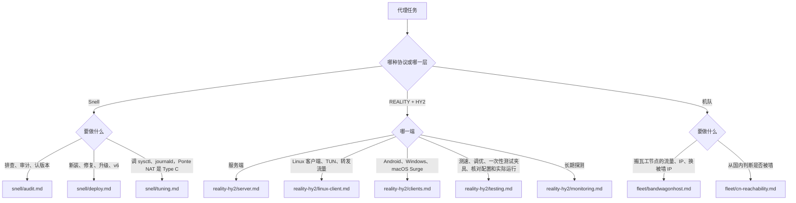

# 运维自建代理机队

## 先分清在动什么

图里的文件都在 `references/` 下：[snell/audit.md](references/snell/audit.md)、[snell/deploy.md](references/snell/deploy.md)、[snell/tuning.md](references/snell/tuning.md)、[reality-hy2/server.md](references/reality-hy2/server.md)、[reality-hy2/linux-client.md](references/reality-hy2/linux-client.md)、[reality-hy2/clients.md](references/reality-hy2/clients.md)、[reality-hy2/testing.md](references/reality-hy2/testing.md)、[reality-hy2/monitoring.md](references/reality-hy2/monitoring.md)、[fleet/bandwagonhost.md](references/fleet/bandwagonhost.md)、[fleet/cn-reachability.md](references/fleet/cn-reachability.md)。

Snell 和 REALITY／HY2 的配置都涉及 secret：Snell 的 PSK 从哪来、怎么交付，先读 [snell/credentials.md](references/snell/credentials.md)；REALITY／HY2 客户端的输入和来源见 [clients.md](references/reality-hy2/clients.md#输入)。Linux 主机从 Clash／Mihomo 迁过来时，新 TUN 验收后读 [linux-migration.md](references/reality-hy2/linux-migration.md) 清旧代理。iOS 上的 sing-box（SFI）不在本包范围。

## 每个任务都适用

**结果分开报。** 服务端、客户端、每种协议各给一个状态：`pass`、`fail`、`not-configured`、`not-attempted`、`inconclusive` 或 `blocked`，写明目标、证据和没覆盖的部分。REALITY 和 HY2 分开报，一个不能代替另一个。配置生成了、`systemctl active`、端口在监听，都只是局部证据，不算端到端通过；没看到的那一层保持 `not-attempted` 或 `inconclusive`。

**动之前先盘点。** 目标 VPS、SSH 身份、端口、预期版本和客户端 policy 都要唯一确定，不从别的主机继承。daemon、配置、listener、端口和防火墙归谁管、secret 从哪来、控制和回滚路径。已有的等价服务、Fake IP 给出的结果、归属不明的进程，先审计；不抢端口，不清旧服务。

**别切断自己的控制路径。** SSH 可能正走在要改的代理上（Surge 增强模式、sing-box TUN）。重启代理或改防火墙之前，证明还有一条不依赖它的路：直连、另一个 SSH 会话或云厂商控制台。

**各改各的。** 服务端修好了，不顺带 reload 本机 Surge 或切 profile；客户端、主机防火墙和 sysctl 的改动各自确定范围，不自动推到别的平台或机器。只点名了 iOS，就不扩大到 Mac。iOS 上只生成配置，请用户在设备上回报语法、TCP、UDP relay 和出口 IP，没回报之前这些项是未验证。

**secret 不外露。** PSK、HY2 密码、REALITY 私钥、搬瓦工 API key 不进聊天、命令行参数、日志、审计证据和 tracked 文件。

**云厂商操作先读回。** 换 IP 这类请求结果不明时，先用 API 读回当前状态，不重复下单。

## 和别的 Skill 的分工

- Snell policy 在 Surge 里的问题（profile、版本、PSK、路由、UDP relay、出口 IP、由 Snell 支撑的 Ponte NAT 类型）留在本包，用审计脚本的 `smoke-surge` 验收（见 [snell/audit.md](references/snell/audit.md#本机-surge-这一侧)）。Ponte 当前背后的 policy 是 Snell 就从本包开始，不用先证明是 Snell 的锅。证据表明和 Snell 无关、属于通用的 Surge 增强模式、DNS、系统代理或非 Snell 的 Ponte 路径时，才转 `$surge`。
- 主机防火墙和全局 sysctl 的写入与回滚、SSH 改造、swap、整机审计用 `$linux-server`；需要哪些端口和协议、参数取什么值，仍由本包给出。
- 长期监控的频率、告警和处置用 `$monitoring`，本包给协议层的探测信号。
