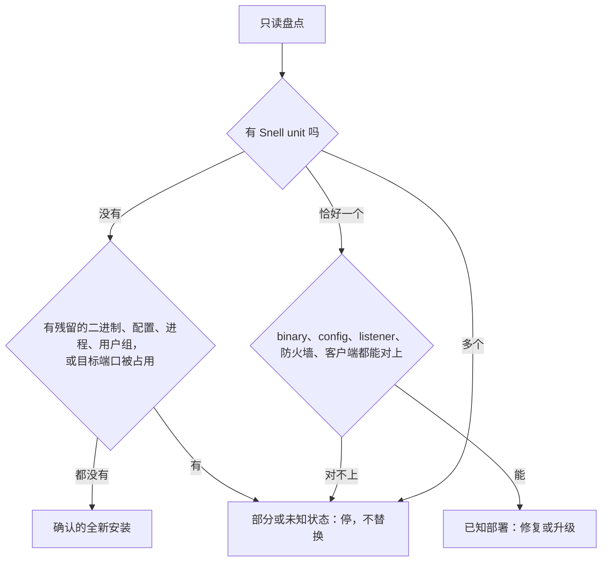

# 部署、修复和升级 Snell

## 先看是哪种主机

- **纯 Snell VPS**：保持朴素，不要变成面板机。用户没要求就不加 Docker、Nginx、面板、dashboard、重型监控或大段防火墙名单。只开 SSH 和 Snell。
- **容器或应用主机**：保留正在跑真实业务的 Docker、x-ui、nginx-proxy-manager、Web 端口和管理端口。关任何东西之前先把公网端口对应清楚。只把 Snell 自己调到基线，不把整机按纯节点的防火墙收紧。

## 先确定目标处于哪种状态

替换任何东西之前，先找到实际的 unit、二进制、配置路径、listener、防火墙由谁管、客户端 profile。配置文件和 unit 里可能有 PSK，只打印元数据和键名，不打印值。



- **确认的全新安装**：用户要新装，只读盘点找不到任何 Snell 文件、listener 或冲突的归属。这时缺文件是正常的。不能因为缺了某一样就推定是全新安装。
- **已知部署**：现有部署能完整对上。停着或坏掉的服务也算，只要能从 unit、drop-in、环境变量和 journal 的私有副本里推出二进制和配置路径，并核实剩余文件、目标端口和归属。没有 `MainPID` 或 listener 不妨碍修复一个已经对上的部署，但修好它不等于把它当全新安装处理。
- **部分或未知状态**：有残留、归属不清或盘点结果互相矛盾。Snell 服务保持只读，不替换。

下面这段脚本只能判出两种情况：全新安装的候选，和正在运行的已知部署。服务停着时它会因为没有 `MainPID` 退出，这时按上面的说法，从 unit、drop-in 和 journal 手工推出路径：

```bash
mapfile -t snell_units < <(systemctl list-unit-files '*snell*.service' --no-legend | awk '{ print $1 }')
if test "${#snell_units[@]}" -eq 0; then
  : "${SNELL_PORT:?set SNELL_PORT to the intended listener before classifying a clean install}"
  clean_conflicts=()
  pgrep -x snell-server >/dev/null && clean_conflicts+=(running-process)
  for path in /usr/local/bin/snell-server /etc/snell /etc/systemd/system/snell-server.service; do
    test ! -e "$path" || clean_conflicts+=("artifact:$path")
  done
  getent passwd snell >/dev/null && clean_conflicts+=(service-user)
  getent group snell >/dev/null && clean_conflicts+=(service-group)
  if ss -H -lntup | awk -v port=":$SNELL_PORT" '$5 ~ (port "$") { found=1 } END { exit !found }'; then
    clean_conflicts+=(intended-port-in-use)
  fi
  if test "${#clean_conflicts[@]}" -ne 0; then
    printf 'partial-or-unknown Snell state:\n' >&2
    printf '  %s\n' "${clean_conflicts[@]}" >&2
    exit 1
  fi
  echo "clean-install candidate: no unit, common artifact, Snell process, service identity, or intended listener"
  echo "inspect firewall ownership and nonstandard paths before confirming clean-install state"
  exit 0
fi
if test "${#snell_units[@]}" -ne 1; then
  printf 'expected exactly one Snell unit, found %d:\n' "${#snell_units[@]}" >&2
  printf '  %s\n' "${snell_units[@]}" >&2
  exit 1
fi
# The remaining mapping applies only to the single known-install candidate.
snell_unit=${snell_units[0]}
systemctl show "$snell_unit" \
  -p User -p Group -p FragmentPath -p ActiveState -p SubState -p MainPID -p NRestarts || exit 1
unit_capture=$(mktemp)
chmod 600 "$unit_capture"
if systemctl cat "$snell_unit" >"$unit_capture"; then
  awk -F= '/^[A-Za-z][A-Za-z0-9]+=/ { print "unit-directive=" $1 }' "$unit_capture"
  grep -Eic 'psk|token|password|secret|credential' "$unit_capture" | \
    awk '{ print "unit-secret-marker-count=" $1 }'
else
  echo "unit contents unavailable; repair mapping not verified" >&2
  rm -f "$unit_capture"
  exit 1
fi
rm -f "$unit_capture"
main_pid=$(systemctl show "$snell_unit" -p MainPID --value)
test "$main_pid" -gt 0 || { echo "Snell has no running MainPID; binary/config mapping not verified" >&2; exit 1; }
binary_path=$(readlink -f "/proc/$main_pid/exe") || exit 1
config_path=$(python3 - "$main_pid" <<'PY'
import pathlib
import sys

args = pathlib.Path(f"/proc/{sys.argv[1]}/cmdline").read_bytes().split(b"\0")
for index, arg in enumerate(args[:-1]):
    if arg in {b"-c", b"--config"}:
        config = pathlib.Path(args[index + 1].decode())
        if not config.is_absolute():
            config = pathlib.Path(f"/proc/{sys.argv[1]}/cwd").resolve() / config
        print(config.resolve())
        break
PY
)
test -n "$config_path" || { echo "running Snell config path could not be derived" >&2; exit 1; }
file "$binary_path" || exit 1
sha256sum "$binary_path" || exit 1
stat -c '%a %U:%G %s %y %n' "$config_path" || exit 1
config_keys=$(awk -F= '/^[[:space:]]*[A-Za-z0-9_-]+[[:space:]]*=/{ key=$1; gsub(/[[:space:]]/, "", key); print "config-key=" key }' "$config_path") || exit 1
test -n "$config_keys" || { echo "no Snell config keys could be inventoried" >&2; exit 1; }
printf '%s\n' "$config_keys"
listener_rows=$(ss -H -tulpen | awk -v pid="$main_pid" 'index($0, "pid=" pid ",") { print }') || exit 1
test -n "$listener_rows" || { echo "running Snell process has no mapped listener" >&2; exit 1; }
printf '%s\n' "$listener_rows"
if command -v ufw >/dev/null 2>&1; then ufw status verbose; fi
if command -v nft >/dev/null 2>&1; then nft list ruleset; fi
```

最近的 journal 存进只有 root 能读的文件，分享片段前遮掉凭据。

## 修复或升级已知部署

按这个顺序：

1. **记基线、留回滚。** 记下装着的二进制的哈希和架构、unit 及 drop-in、配置元数据、listener、防火墙由谁管、服务用户、目标客户端 profile。升级前能拿到可用客户端的基线就拿；服务坏着就记下失败的路径和预期结果。二进制、unit、配置的回滚副本放在目标路径之外。方案要改主机防火墙时，用 `$operate-linux-servers` 建并保留它的回滚状态。

   当前 SSH 能连只证明此刻能连。记下它走的是 Surge、别的代理还是直连外部路径，并证明重启这个 Snell 服务不会断掉唯一的控制和回滚路径。重启前在同一条依赖上开的 SSH ControlMaster 不算独立的恢复路径。

2. **暂存并核验二进制。** 在只有 root 能进的临时目录里放官方包，架构和目标版本都要对上。预发布版的 `snell-server -v` 可能只报基础版本和构建日期，不带 beta 或 RC 后缀，不能只凭它认版本；拿装着的二进制和从确切官方发布地址重新下载的字节比，或者和用户提供的摘要比。官方发布了摘要就核对；没有官方摘要时，本地记的 SHA-256 只能证明下载和暂存的字节一致，不能证明是发布者认证过的。

   上传的文件先显式设可执行权限再运行，不要假设 `/run`、`/tmp` 或别的临时挂载允许执行。用 `findmnt -no OPTIONS --target "$staged_binary"` 看暂存位置的挂载选项；是 `noexec` 就把核验过的字节拷到能执行的文件系统上一个 root 拥有、`0700` 的暂存文件里（最好就在最终二进制旁边），在那里跑版本探测。替换或恢复正在运行的二进制，先写旁边的文件再原子 rename；直接覆盖正在执行的 inode 可能报 `ETXTBSY`。

3. **暂存配置。** `root:snell`、`0640`，用当前版本的字段。不回显 PSK。服务用户要能穿过完整的父路径：放在只有 root 能进的 `/root` 下面的文件，哪怕组可读，服务也读不到。最好把暂存文件放进核验过的配置目录里当隐藏文件，确认服务用户能读但不能替换这个 root 拥有的文件。改 TCP/UDP 规则前，用同一个服务端版本和客户端 profile 确认传输需求。

4. **暂存 unit 或 drop-in，跑 `systemd-analyze verify`。** 报错、必需指令被忽略、会影响行为或说不清的警告，都挡住上线，哪怕退出码是 0；查实无害的警告记下依据（装着的版本的文档和实际生效的配置）。回滚文件和当前 SSH 恢复路径都证实之前，不覆盖线上的 unit 和二进制。

5. **一次性切换。** 先经 `$operate-linux-servers` 改防火墙，然后在同一个维护窗口里换二进制、配置和 unit，`daemon-reload`，只重启一次。起不来、listener 没出现、用户不对、反复重启或客户端验证失败，就按相反顺序恢复服务文件，执行保留的防火墙回滚，重新 reload systemd，并和变更前的基线（包括原来的故障）对比恢复后的文件和服务状态。

6. **验收。** 看 `ActiveState`、`NRestarts`、确切的 TCP/UDP listener、防火墙规则，再从主机外面发一次端到端客户端请求。重启后在有限的截止时间内轮询 `MainPID` 和 `ss -H -lntup`，直到每个预期的 socket 都属于当前进程；`ActiveState=active` 可能早于 listener 出现。超时就算修复失败，触发回滚。只有外部请求通过才算修好。

## 全新安装

全新安装是另一套事务，因为上面那些前提都不存在。

1. 记下服务用户、组、配置目录、防火墙规则、unit、配置和二进制在事务开始前是否存在。每次写最终路径之前，重新确认全新安装的前提还成立。
2. 核验官方暂存包，挂好回滚守卫，然后把核验过的、root 拥有的同目录副本放到最终二进制路径，**不启动**，用原子的不覆盖操作：同一文件系统内 hard link 再删掉暂存名可以；普通 `mv` 或 rename 可能覆盖盘点之后才出现的路径，不行。最终二进制在位后再校验暂存的 unit；`systemd-analyze verify` 失败就删掉这次事务放的二进制。
3. 校验通过后，用排他的 `mkdir` 建不存在的配置目录，不用 `mkdir -p`，也不用会改权限的 `install -d`。配置和 unit 都在目标文件系统上暂存成 root 拥有的同目录文件，用同样的原子不覆盖规则放进去。盘点之后有任何最终目录或文件冒出来，就停下重新判断主机状态，不覆盖。
4. 经 `$operate-linux-servers` 改主机防火墙，reload systemd，全部放好之后才启动。每项服务资源的回滚标记，只在这次事务成功创建它之后才设。
5. 之后任何一步失败：按相反顺序回滚 unit、配置、二进制，执行保留的防火墙回滚，只删掉能证明是这次事务创建的目录、服务用户或组。盘点之后才出现的、事务开始前就有的资源，一律不删不覆盖。

## Snell 服务本身

`snell-server` 从官方 zip 取：`https://dl.nssurge.com/snell/snell-server-v<VERSION>-linux-<ARCH>.zip`。当前版本、可用架构和发布说明看 Surge Knowledge Base 的 Snell 页面。不用第三方一键脚本：它们会加面板和防火墙规则。

用独立的服务用户。下面的 `install -d` 适用于已知部署；全新安装时配置目录按上一节用排他的 `mkdir` 建：

```bash
getent group snell >/dev/null || groupadd --system snell
id snell >/dev/null 2>&1 || \
  useradd --system --gid snell --home-dir /nonexistent \
    --shell /usr/sbin/nologin snell
install -d -o root -g snell -m 0750 /etc/snell
install -o root -g snell -m 0640 snell-server.conf \
  /etc/snell/snell-server.conf
runuser -u snell -- test -r /etc/snell/snell-server.conf
if runuser -u snell -- test -w /etc/snell/snell-server.conf; then
  echo "snell service user must not be able to rewrite its config" >&2
  exit 1
fi
if runuser -u snell -- test -w /etc/snell; then
  echo "snell service user must not be able to replace its config" >&2
  exit 1
fi
```

`/usr/local/bin/snell-server` 保持 root 拥有、可执行。下面的 unit 装成 `/etc/systemd/system/snell-server.service`，权限 `0644`；`daemon-reload` 之前跑 `systemd-analyze verify /etc/systemd/system/snell-server.service`。启动后确认 `systemctl show snell-server.service -p User -p Group` 报的是 `snell`，进程仍能读到同一个配置路径。

```ini
[Service]
Type=simple
User=snell
Group=snell
ExecStart=/usr/local/bin/snell-server -c /etc/snell/snell-server.conf
Restart=always
RestartSec=2
LimitNOFILE=1048576
UMask=0077
```

这个 unit 保留了权限分离和自动重启，没有沙箱。默认不加激进的 systemd 加固：`PrivateDevices`、`ProtectSystem`、`RestrictAddressFamilies`、大范围的 capability 限制、`NoNewPrivileges`、`PrivateTmp` 都可能弄坏 v5 的 UDP/QUIC（症状见 [audit.md](audit.md#v5-udp-崩溃)）。用户要求加固时才加，加完测 Snell 的 UDP 路径。服务正常运行时，不要为了套这个 unit 去重写它。

传输需求从装着的版本、官方发布说明、服务端配置、listener、防火墙和客户端 profile 推出来。不要拿旧版本去推未来或未发布版本的 UDP/TCP 行为。

## v6

Snell v6 的发布状态以 Surge Knowledge Base 为准；还是 beta 时协议可能有不兼容的改动，按金丝雀对待。

- 服务端和 Surge 都要支持 v6。最低 Surge 版本和 policy 参数看 Surge 手册的 Snell 页面，以装着的 Surge 为准。
- 每个 v6 金丝雀用新的高熵 PSK，不复用 v5 的，也不在节点间共用。协议特征由 PSK 推出，不加旧的 `obfs`。
- 普通 v6 只走 TCP。v6 没有 v5 的 QUIC 代理模式；Surge 那边保持 `block-quic=on` 或平台默认。
- 服务端 `mode` 保持默认，用户明确要测别的模式时才改；改了 Surge policy 的 `mode` 要和服务端一致。
- 服务端配置的键和取值，以要装的那个 `snell-server` 的 `--help` 和 Surge Knowledge Base 的发布说明为准，不按别的版本推。v5 配置里的 `ipv6 = false` 换成 `dns-ip-preference = ipv4-only`；`ipv6` 键只用来兼容旧配置。

Surge profile 写法：

```ini
node-name = snell, <host>, <port>, psk=<fresh-psk>, version=6, block-quic=on
```

最小服务端配置：

```ini
[snell-server]
listen = 0.0.0.0:<port>
psk = <fresh-psk>
dns-ip-preference = ipv4-only
```

改成 v6 之前，这台 VPS 要满足：

- `audit-snell` 能跑完，Snell 服务在运行，审计找到了配置路径。
- 方案写明了二进制、配置、systemd unit 和防火墙状态的备份路径。
- SSH 用的是明确的密钥或 agent 身份。
- SSH 和回滚路径已证明不依赖要重启的 Snell 服务或 policy。增强模式开着时，Surge 的请求记录要再用一条不受影响的外部或带外路径佐证。
- 回滚方案能恢复旧的二进制、配置和 unit；原来是 v5 UDP/QUIC 的，回滚还要重新开 UDP。

改完之后逐项确认：

- `snell-server -v` 报预期的 v6 大版本和构建信号，装着的二进制的 SHA-256 和从官方地址重新下载的产物字节一致。
- systemd 是 `ActiveState=active`、`SubState=running`、`NRestarts=0`。
- `ss -lntup` 在 Snell 端口上有 TCP listener，没有 UDP listener。
- 防火墙放行 `<port>/tcp`，不放行 `<port>/udp`。
- 脱敏后的配置里没有旧的 `ipv6`、`obfs`、`reuse`、`version`。
- journal 没有参数错误，特别查 `dns-ip-preference` 是否非法。
- 本机 profile 过 `surge-cli --check`；本机和远端 PSK 一致，比对时不记明文。
- `surge-cli --raw test-policy <policy>` 和 `surge-cli --raw test-policy-external-ip <policy>` 成功。
- `test-policy-udp` 成功，走的是经 TCP 代理的 UDP relay，不代表服务端该开 UDP。
- Surge Ponte 用到的 Snell policy，`test-policy-nat-type` 应为 Type A（`nat-type=1`），除非这个流程接受更低的 NAT 类型。普通代理测试都过而 NAT 还是 Type C（`nat-type=3`），放行 VPS 的临时 UDP 源端口段（见 [tuning.md](tuning.md#surge-ponte-的-nat-类型是-type-c)），不开 Snell 端口的 UDP。

稳定的机队不升到没验证过的版本；协议大版本变化按有计划的迁移来做。

## SSH

保持已经核实的 SSH 归属方式和只用密钥登录。用户没要求，不在单主 Snell VPS 上强加非 root 管理员、`AllowUsers` 或猜出来的 `MaxAuthTries`。单独的 SSH 改造或整机访问审计归 `$operate-linux-servers`。

## 防火墙

这里只定 Snell 需要哪些端口，主机防火墙的事务归 `$operate-linux-servers`。纯 Snell VPS 至少放行 SSH 和 Snell 的 TCP 端口：

```text
22/tcp
<snell-port>/tcp
```

装着的服务端和客户端配置确实用 UDP/QUIC 时才加 `<snell-port>/udp`。改防火墙前后都要验 UDP listener 和一条应用层的客户端路径。不检查就关 UDP，可能断掉在用 UDP/QUIC 的 v5 部署。

要写或回滚主机防火墙时才加载 `$operate-linux-servers`：把核实过的 SSH 和 Snell 端口／协议需求交给它，留着它打印的回滚状态，直到这边的外部客户端路径通过。

sysctl、journald、swap 见 [tuning.md](tuning.md)。
