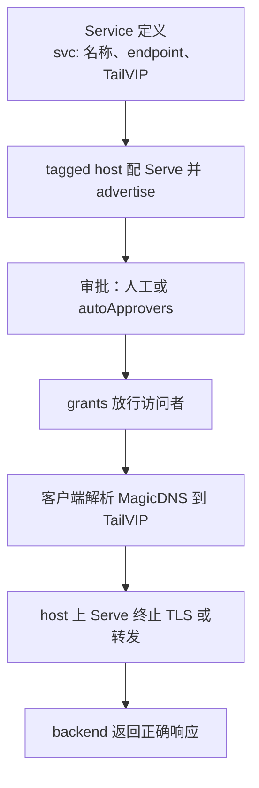

# 运维 Tailscale Services

Tailscale Service 是不绑定某台机器的 tailnet 内部服务：一个稳定的 MagicDNS 名称和 TailVIP，背后是一台或多台已批准的 tagged host，host 上的 Serve 把流量转给真实 backend。

官方文档：[Tailscale Services](https://tailscale.com/docs/features/tailscale-services.md)、[Service 配置文件](https://tailscale.com/docs/reference/tailscale-services-configuration-file.md)、[Tailscale API 的 services 部分](https://tailscale.com/api#tag/services)。命令用法看本机 `tailscale serve <子命令> --help`。客户端低于 1.94 先升级。

本 Skill 从「host 能访问 backend」开始管。host 上的 `tailscaled`、systemd、防火墙，以及 libvirt guest 做 backend 时的宿主网络，归 `$operate-linux-servers`；macOS 上 Tailscale 和 Surge 共存归 `$surge`。JetKVM 这类精简固件设备上，Tailscale 的安装、CA 和开机自启按设备自己的方式来，不套普通 Linux 的 systemd 做法。

## 链路



每一层都会单独坏。控制台显示 Connected、TailVIP 能连、TLS 握手成功、backend 返回 200，任何一项都不能代表整条链通了。

## 容易出事的地方

- **host 必须是 tag 身份。** 用户账号登录的设备不能当 Service host。不为了接 Service 把用户身份的机器改成 tag 身份，打什么 tag、tag 归谁管要单独定。
- **endpoint 是接口。** 定义里只写真正要发布的 TCP 端口（如 `tcp:443`）。不用 `do-not-validate` 跳过校验来掩盖配置不一致。
- **grants 只会叠加放行。** 新加一条只开 443 的 grant，挡不住已有的 `*` 或更宽的规则。要说「已隔离」，先看完整 policy，再跑 access control tests 和真实的正反两个身份。
- **`tailscale serve reset` 清空整台节点的 Serve**，包括节点自己的 Serve、Funnel 和所有 Service。只动一个 Service 时用 `serve clear svc:<name>`（有映射时同时取消发布；没有映射时什么都不做，要另外 `drain`），或者删单个 endpoint：`tailscale serve --service=svc:<name> --https=443 [--set-path <path>] off`（不取消发布）。
- **`off` 不带 `--set-path` 会删掉该端口下所有路径。** 它的确认提示只在交互终端里出现，Agent 的 shell 没有 TTY，会直接全删。只删一条就必须带 `--set-path`。
- **写入映射就会发布。** `tailscale serve --service=...` 每次写入都会 advertise，drain 过的 host 也会立刻重新接新连接。想先验证再发布，见 [references/control-plane.md](references/control-plane.md#用配置文件改-host) 的 `"advertised": false` 做法。
- **一台 host 上可能挂着别的 Service 和节点 Serve。** 写之前留快照，写完逐项对比没动的部分。
- **Funnel 会把服务发到公网**，tailnet 内的 Service 用不着它。

## 改之前先看清现状

在 host 上读：

```bash
tailscale version
tailscale status --json | jq '{BackendState, Health, Self: {Online: .Self.Online, ServiceHost: .Self.CapMap."service-host"}}'
tailscale serve status --json
tailscale debug prefs | jq '.AdvertiseServices'
tailscale serve get-config --all
```

三样东西要分清：

- `AdvertiseServices` 是这台 host 当前发布了哪些 Service。下面两份配置都不完整反映它，写映射、`set-config`、`clear`、`drain` 都会改它，改前改后都要对比。
- `serve status --json` 是这台节点完整的 Serve 配置（节点 Serve、Funnel、所有 Service 的全部路径），对比「别的有没有被动到」用它。
- `serve get-config --all` 只导出 Service，格式能直接喂给 `set-config`，带 `advertised` 状态；但它是有损的：HTTP 和 HTTPS 端口只导出根路径 `/`，`--set-path` 挂的其他路径、`text:` 目标、`--accept-app-caps` 和 `--proxy-protocol` 都不会出现；任何一个 Service 的端口缺根路径时，`--all` 整份报错、没有输出。它的 `--help` 写着 `<file>` 参数，实际只往 stdout 写，参数被忽略。

这些都存成仅本人可读的文件（`umask 077` 后 `mktemp`，重定向后 `test -s` 确认非空），只在本次变更和验收期间保留。用户连本地落盘也不允许时，存在 shell 变量或程序内存里，照样检查退出码和非空，只输出需要的字段。这些配置含内网拓扑，不整份打印进会话。

还要从控制台或 API 拿到：Service 的 endpoint、tags、MagicDNS 名称和 TailVIP；每台 host 的审批、在线、draining 状态；完整的 grants 和 autoApprovers。

Service 名称、端口、谁能访问、backend 是哪个，决定了对外接口和暴露面，要有明确的值才动手。

## 创建或接入

1. **先在 host 上直接请求 backend**，确认协议、地址、路径和应用响应都对。Serve 修不好一个 host 自己都连不上的 upstream。
2. **定义 Service。** 在控制台 Services 页或 API 创建 `svc:<name>`，记下控制面返回的 MagicDNS 名称和 TailVIP。定义好了不代表有可用的 host。
3. **在 host 上配 Serve。** CLI 一条命令同时配置和 advertise，默认后台运行：

   ```bash
   tailscale serve --service=svc:<name> --https=443 http://127.0.0.1:<backend-port>
   ```

   backend 在 host 能路由到的 VM 或局域网地址上时，直接写那个 URL，不用在 host 上再套一层本地代理。但在 macOS App Store 版、Standalone 版，或 `tailscaled` 没用 `SO_MARK` 的 Linux 上，CLI 不接受非本机目标：报错退出、不写映射，而这个 Service 在报错前已经被 advertise 了。遇到这个错误，回读 `AdvertiseServices` 和 `serve status --json`，需要时 `drain`。Linux 可以改用 userspace-networking 模式，见官方文档的 Limitations。

   单个 endpoint 用上面的 CLI 增量改。只有整份 Service 配置文件本来就是维护的来源时才用 `set-config`，做法和坑见 [references/control-plane.md](references/control-plane.md#用配置文件改-host)。
4. **读回对比。** 重读上面三样，确认目标映射和定义里的 endpoint 一致，别的 Service、节点 Serve 和发布列表没变。
5. **审批。** 没有 autoApprovers 时，由 Owner、Admin 或 Network admin 在控制台批准待审的 host。点完按钮再回读一次，确认 host 已经 active。
6. **验访问策略。** 读完整 grants，跑 access control tests，再用一个有权限、一个没权限的身份实测。只有正向客户端时，把负向身份这一层标成「未验证」。
7. **验数据面。** 按 [references/verification.md](references/verification.md) 验 DNS、TailVIP、TLS、真实页面和不该开的端口。

控制面怎么操作（API 还是控制台）、autoApprovers 怎么取舍、需要用户在浏览器登录时怎么交接，看 [references/control-plane.md](references/control-plane.md)。

## 更新、迁移和删除

改 endpoint、重启 host 或下线 host 前，先在这台 host 上 drain：

```bash
tailscale serve drain svc:<name>
```

drain 让这台 host 不再接新连接，已有连接继续跑到自己关闭。命令返回不代表连接已经清空，按业务能接受的时间等。注意用 CLI 写入新映射的那一刻 host 就重新发布了；只删映射（`off`）不会。改完没自动发布的，用 `tailscale serve advertise svc:<name>` 恢复，然后整条链重新验一遍。

只有一台 host 时，drain 和重启都会让服务中断。这种情况按维护窗口处理，不说成无感切换。

删除按这个顺序：drain，等连接结束，`off` 或 `serve clear svc:<name>` 删 host 上的映射，回读控制面确认 host 已下线，最后用户明确要删时才删 Service 定义。删 host 配置不等于要删 `svc:` 名称、grants 和 DNS 名，这些是稳定接口。

## 排查

| 现象 | 先查 | 别做 |
| --- | --- | --- |
| Pending approval | autoApprovers 或人工审批 | 再建一个同名 Service |
| Needs configuration | 定义里的 endpoint 和 host 上的映射是否一致 | 用 `do-not-validate` 盖过去 |
| Offline 或 host 列表里没有这台 | host 是否 tag 身份（不是会被 CLI 直接拒绝）、是否在线、`AdvertiseServices`、Serve 配置 | 先去改 backend |
| TailVIP 连不上 TCP | 客户端版本、grants、host 是否已批准且 active | 先重签证书 |
| TCP 通但 HTTPS 暂时失败 | SNI、Serve 映射、证书签发日志，有限次轮询 | 反复 clear 再重建 |
| TLS 正常但页面错 | host 到 backend 的真实请求、Host、路径和 header | 改 TailVIP 或 grants |
| 一台 host 下线就中断 | 有没有第二台已批准的 active host、下线前有没有 drain | 把有 Service 名称当成高可用 |

## 交付时报告

- Service 定义、已批准的 active host、TailVIP 和 DNS；
- host 上其他 Service 和节点 Serve 是否原样保留；
- grants 实际放行到哪，正反两个身份的测试结果；
- 正常域名 HTTPS 和直连 TailVIP 加 SNI 的结果、证书签发者和到期时间、真实页面；
- 不该开的端口；
- drain 和重启是否实测过。

只靠读配置确认、没做数据面验证的层，单独列出来。
