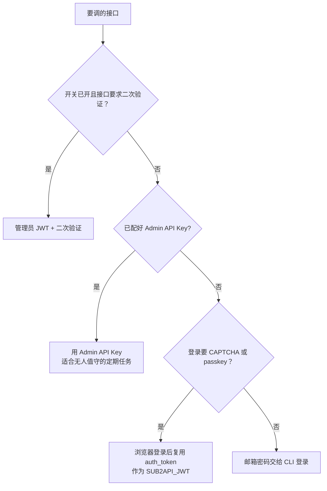

# Sub2API 鉴权

## 三种凭据能调什么

下文的「二次验证」指 step-up：登录之后，调敏感接口前再输一次 TOTP，和登录时的 2FA 是两回事，见[二次验证](#二次验证step-up)。

| 凭据 | 普通 Admin API | 用户或会话 API | 要二次验证的接口 | 有效期 |
| --- | --- | --- | --- | --- |
| Admin API Key（`x-api-key`） | 能，服务端把它当成 ID 最小的管理员 | 不能 | 不能 | 到删除或重新生成为止 |
| 管理员 JWT | 能，前提是用户仍有效且仍是管理员 | 能，含支持的 WebSocket | 完成二次验证后能 | 会过期；可能绑定 IP 和 User-Agent |
| 邮箱和密码 | 换成管理员 JWT 再用 | 同 JWT | 登录后再做二次验证 | 本身不是可复用的服务端凭据 |
| 普通用户 Key（`sk-...`） | 不能 | 不能 | 不能 | 只用于网关推理 |

普通 Admin API 上，Admin API Key 和管理员 JWT 能做的事差不多；JWT 还能代表真实用户会话，完成 TOTP 二次验证后权限最大。

## 二次验证（step-up）

二次验证由后台设置里的开关控制，默认关闭。开关打开后，敏感接口只接受完成二次验证的管理员 JWT，Admin API Key 一律 403（`STEP_UP_ADMIN_API_KEY_FORBIDDEN`）。这类接口包括账号和代理的数据导出、备份的创建、下载和恢复、备份或对象存储目标的变更、插件的上传、启停、删除、配置和测试，以及新建管理员或把用户提升为管理员。完整名单看部署版本源码 `backend/internal/server/routes/admin.go` 里挂了 `stepUpAuth` 的路由，以及 handler 里调 `EnforceStepUp` 的地方。开关关闭时，这些接口对 Admin API Key 也放行。

不看开关、始终拒绝 Admin API Key 的操作：打开或关闭二次验证开关（关闭时要求完成二次验证的 JWT）、清空审计日志。清空审计日志每次都要在请求里带新的 TOTP 验证码，不复用二次验证的有效窗口。

## 登录

CLI 只用选中的那一种凭据：设了 Admin API Key 或 JWT，就算也给了邮箱密码也不会登录。

用邮箱密码时，CLI 调 `POST /api/v1/auth/login`，拿到的访问令牌只留在内存里，这个进程的所有请求共用它，进程退出就没了。返回 `requires_2fa` 时，给这次调用设一个新的 `SUB2API_LOGIN_TOTP_CODE`。部署开了 CAPTCHA 时，在浏览器里登录，再把浏览器 localStorage 里的 `auth_token` 作为 `SUB2API_JWT` 交给 CLI；不用自动化绕过验证。

每次密码登录都会新建一个会话（带随机会话 ID 的 JWT，通常还有一组新的刷新令牌），不会吊销旧 JWT。旧 JWT 是否还有效，看它是否过期、密码是否改过、用户状态或角色是否变了，以及会话绑定；吊销会话只删刷新令牌，已签发的访问令牌到期前仍可用。

邮箱密码模式下，每个 `node` 进程都会登录一次、新建一个会话。要查多个接口时，优先用 `diagnostics` 这类一条命令查完的聚合命令；要连调多个 `api` 时，用 Admin API Key，或先在浏览器登录拿 JWT 再复用。

不要用临时 `curl` 登录，那样密码、登录响应和刷新令牌会留在 shell 历史和终端输出里。

## 会话绑定

后台设置里可以开会话绑定，默认关闭。开了以后，JWT 签发时记下服务端看到的客户端 IP 和 User-Agent，之后每个请求都要对得上。对不上时服务端返回 401（`SESSION_BINDING_MISMATCH`），写一条安全审计事件，并吊销这个会话的全部刷新令牌。

复用浏览器的 JWT 时，CLI 要从同一个出口 IP 发请求，并把 `SUB2API_USER_AGENT` 设成浏览器当时的完整 User-Agent；其他 Header 和 cookie 不用复制。CLI 默认的 User-Agent 是 `sub2api-admin-cli/1.0`，登录请求和之后的 JWT 请求用同一个值，所以 CLI 自己登录的会话不受影响。边缘防火墙只放行特定 User-Agent 时，也用 `SUB2API_USER_AGENT` 改。

## Admin API Key

全站只有一个 Admin API Key，不分权限范围。管理员 JWT 和当前 Admin API Key 都能调 `POST /api/v1/admin/settings/admin-api-key/regenerate`：没有 Key 时创建，有就覆盖，旧 Key 立刻失效。完整新值只返回这一次，之后面板只显示掩码。

不要为了拿到访问权限去生成或轮换 Key。CLI 的 `admin-key` 命令和失败后的恢复步骤见 [CLI 参考](admin-cli.md#admin-api-key)。
